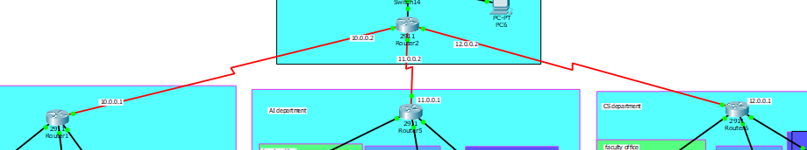
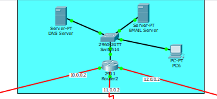
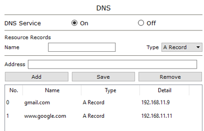
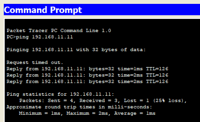
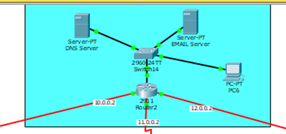
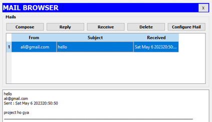
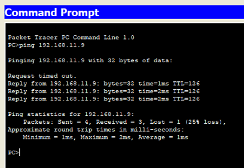

# University-Network-Model

## Device use
- 60 Generic Computers
- 12 Switches (2960)
- 4 Routers (2911)
- 2 Generic Servers

## Assign DHCP

 

## Subnetting

IP used 193.168.1.0, 193.168.2.0, 193.168.3.0 and 193.168.40.0 2^2 = 4 (number of networks) 2^6 = 26 (number of hosts) 64-2 = 64 (IP that can be assigned) Subnet mask = 255.255.255.192/26 Binary = 11111111.11111111.11111111.11000000

| Network address          | Usable Host Range             | Broadcast Address      |
|--------------------------|-------------------------------|------------------------|
| 192.168.1.0              | 192.168.1.1 - 192.168.1.62    | 192.168.1.63           |
| 192.168.1.64             | 192.168.1.65 - 192.168.1.126  | 192.168.1.127          |
| 192.168.1.128            | 192.168.1.129 - 192.168.1.190 | 192.168.1.191          |
| 192.168.1.192            | 192.168.1.193 - 192.168.1.254 | 192.168.1.255          |

## Dynamic Routing

| Network Address     |
|---------------------|
| 11.0.0.0            |
| 12.0.0.0            |
| 192.168.1.0         |
| 192.168.2.0         |
| 192.168.3.0         |
| 192.16.11.0         |

## DNS Server

 

## Email Server

 

