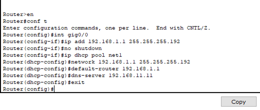
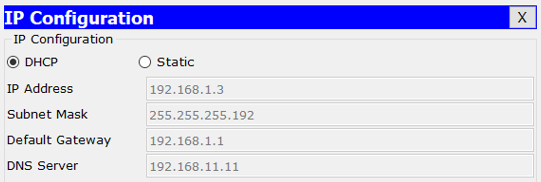

# University-Network-Model

## Device use
- 60 Generic Computers
- 12 Switches (2960)
- 4 Routers (2911)
- 2 Generic Servers

## Assign DHCP

 

## Subnetting

Ips used 193.168.1.0, 193.168.2.0, 193.168.3.0 and 193.168.40.0
2^2 = 4 (number of networks)
2^6 = 26 (number of hosts)
64-2 = 64 (IP that can be assigned)
Subnet mask = 255.255.255.192/26
Binary = 11111111.11111111.11111111.11000000

| **Network address**              | **Usable Host Range**            | **Broadcast Address**
|------------------------------|------------------------------|
| (1,2,3,4).0 – (1,2,3,4).63   | (1,2,3,4).1 –(1,2,3,4).62    |
| (1,2,3,4).64 –(1,2,3,4).127  | (1,2,3,4).65 –(1,2,3,4).126  |
| (1,2,3,4).128 –(1,2,3,4).191 | (1,2,3,4).129 –(1,2,3,4).190 |
| (1,2,3,4).192 –(1,2,3,4).255 | (1,2,3,4).193 –(1,2,3,4).254 |
